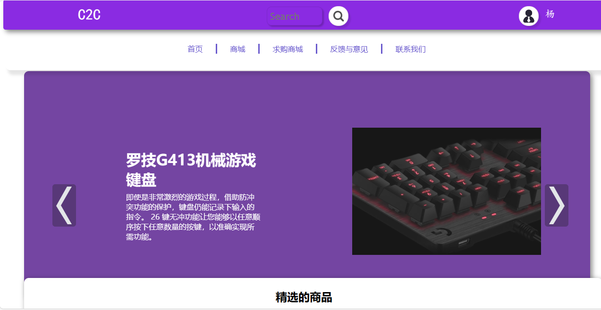
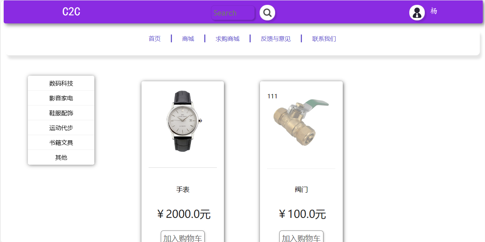
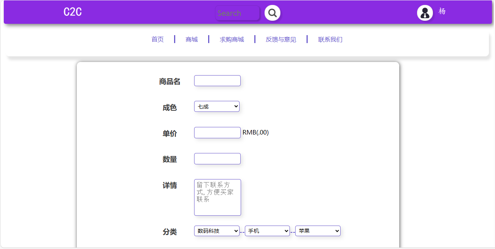
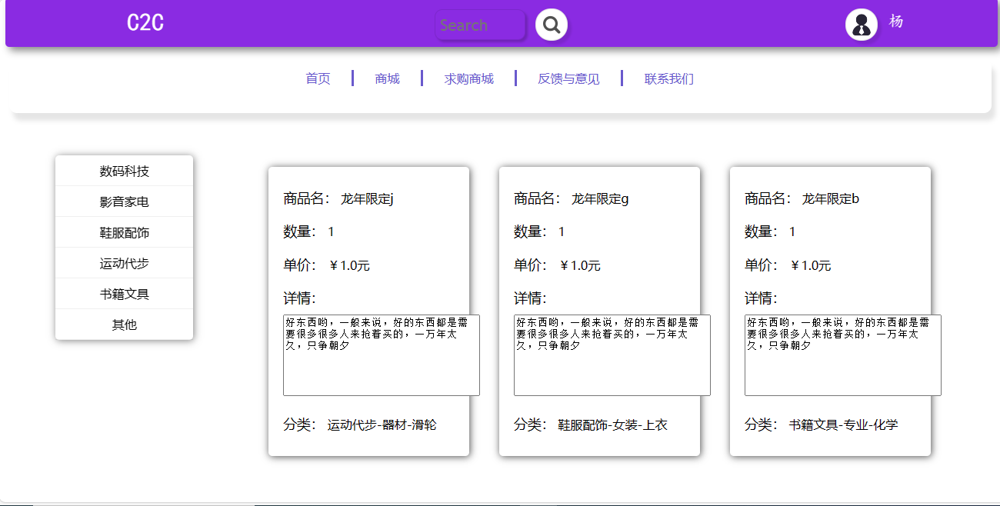
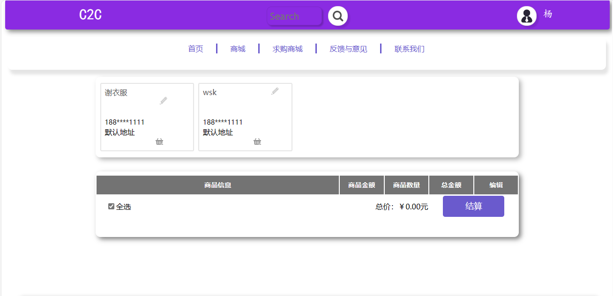

<h1 align="center">21.基于ssm的C2C二手交易平台管理系统</h1>

 获取sql文件 QQ: 386869957 QQ群: 377586148 

 [推荐站点: 从戎源码网](https://armycodes.com/) 

## 简介

> 本代码来源于网络,仅供学习参考使用!
> 
> 注意: 修改图片路径：项目前缀路径webapp/image，设置image目录为图片服务器映射目录
>
> 提供1.远程部署/2.修改代码/3.设计文档指导/4.框架代码讲解等服务
>
> 用户登录: http://localhost:8080/login.do
>
> 用户: 18616959966  密码: 123456
>

## 项目介绍

基于ssm的C2C二手交易平台管理系统：前端 thymeleaf、jquery，后端 springmvc、spring、mybatis，发布自己闲置的商品，同时自己也可以发布求购商品信息，支持加入购物车，在线下单

主要功能如下：

### 用户：

- 基本功能：登录、注册、退出、个人信息查看、个人信息修改
- 核心功能：首页轮播图展示、精选商品列表、求购商城商品列表、分类商品展示、发布商品、商品图片上传、发布求购信息、购物车功能、商品结算、我求购的商品列表

## 环境

- <b>IntelliJ IDEA 2009.3</b>

- <b>Mysql 5.7.26</b>

- <b>Tomcat 7.0.73</b>

- <b>JDK 1.8</b>

## 运行截图

